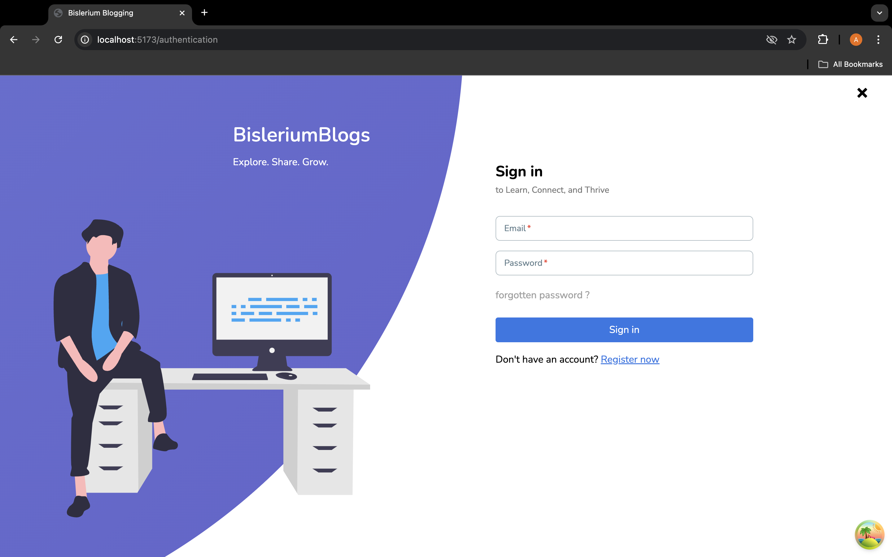
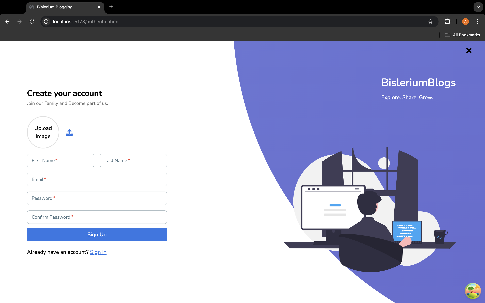
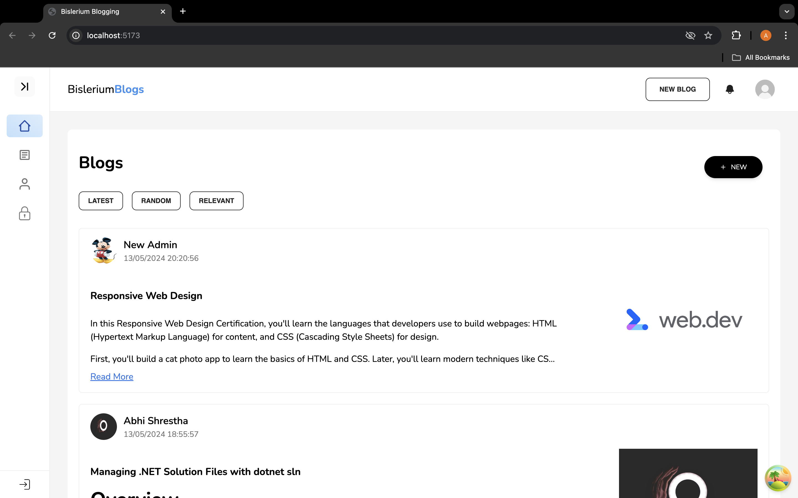
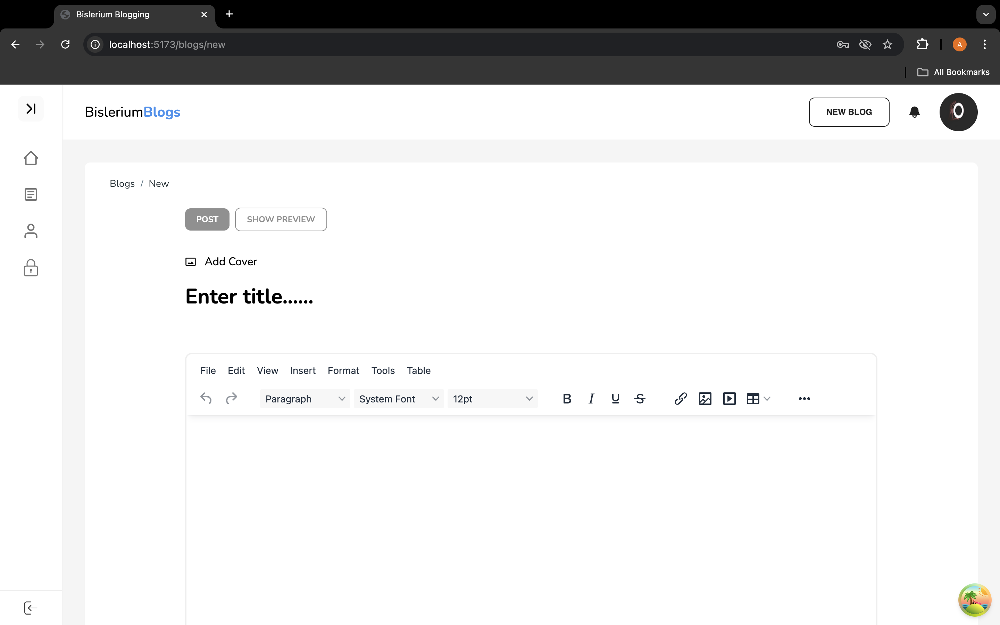
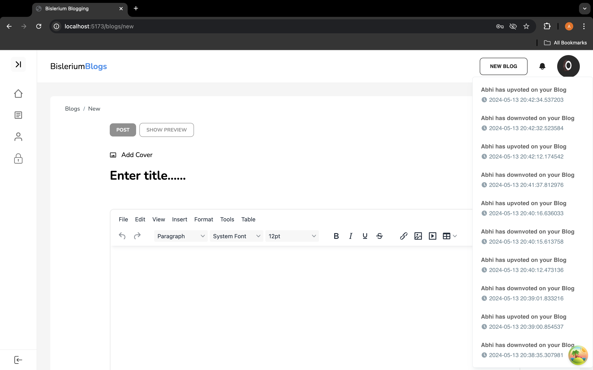
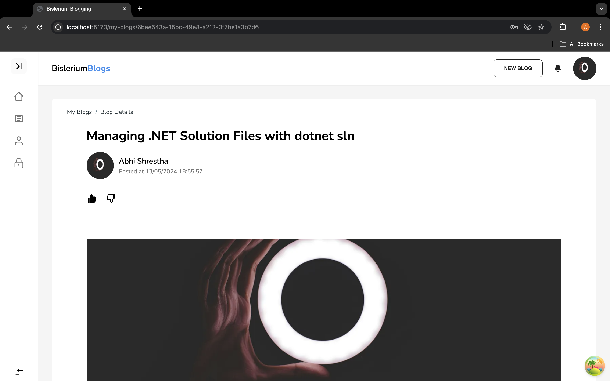
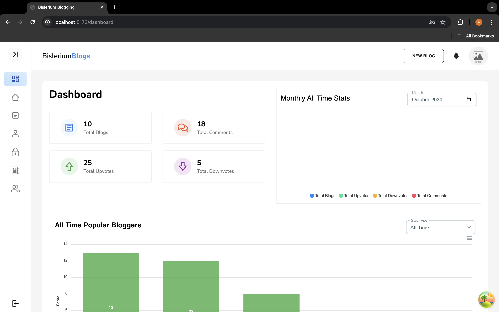

# Blogging Application (C#, React JS, PostgreSQL)

## Overview

This project is a full-stack blogging platform built using **C# (ASP.NET)** for the back-end, **React.js** for the front-end, and **PostgreSQL** for the database. It allows users to create, interact with, and manage blogs while offering real-time notifications, admin metrics dashboards, and optimized performance.

---

## Key Features

- **Blogging Platform**:
  - Users can create blogs with rich content, including text, images, and formatting.
  - Interactive features: upvotes, comments, reactions.
  - Efficient sorting, pagination for a smooth experience.
  
- **Real-Time Notifications**:
  - Integrated **SignalR** for real-time push notifications.
  
- **Admin Dashboard**:
  - Includes blog and user activity insights using **LINQ** for querying and aggregation.
  
- **Modular Architecture**:
  - **Interface-based design** for modular, maintainable code.

- **API Documentation**:
  - **Swagger** for API documentation and testing.

---

## Technologies Used

- **Front-end**: React.js
- **Back-end**: ASP.NET (C#)
- **Database**: PostgreSQL
- **Real-Time**: SignalR
- **Data Queries**: LINQ
- **API Documentation**: Swagger

---

## Screenshots

---

